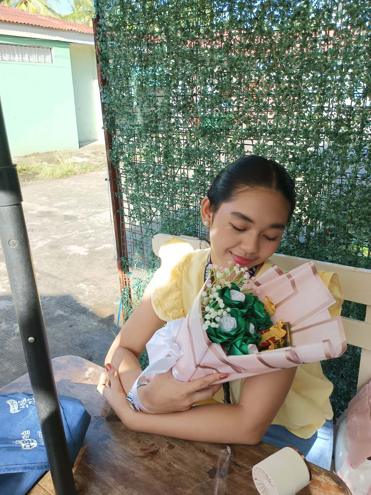

<!DOCTYPE html>
<html lang="en">
<head>
<meta name="viewport" content="width=device-width, initial-scale=1.0">
<meta charset="UTF-8">
<title>For Normalen ❤️</title>

</head>

<body>

<audio autoplay loop>
<source src="music.mp3" type="audio/mpeg">
</audio>

<button onclick="startSurprise()">Open Surprise 💌</button>

</body>
</html>
